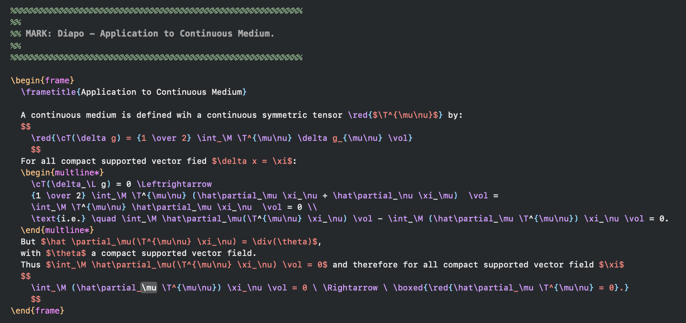

# TeX & LaTeX Syntax Highlighting for Xcode

This plugin provides full-featured syntax highlighting for TeX and LaTeX documents directly within the Xcode IDE, turning it into a powerful, minimalist environment for academic and technical writing.

It was originally created by Patrick Iglesias-Zemmour and has been updated and improved in collaboration with Google's Gemini to be more robust and stable for modern Xcode versions.



## Features

*   **Robust Highlighting:** A stable, predictable, and fast highlighting engine.
*   **Full Math Environment Support:**
    *   **Displayed Math (`$$...$$` and `\[...\]`):** The entire block is colored, with commands and braces highlighted inside for readability.
    *   **Inline Math (`$...$`):** The entire block is given a solid color to make it stand out clearly from surrounding text.
*   **Code Folding:** All `\begin{...}...\end{...}` environments are fully foldable.
*   **Structure Highlighting:** Commands, braces, and comments are clearly distinguished.
*   **Light and Dark Themes:** Includes "Basic TeX" (Light) and "Dark TeX" (Dark).

## Compatibility

*   **Modern Xcode (15+):** Works natively. You must click **"Load Bundle"** when Xcode launches.
*   **Older Xcode (12-14):** Supported via UUID matching. See the `Info.plist` if you need to add a specific UUID.

## Installation

### Automated Installation (Recommended)

1.  Download the `.zip` file from the latest [Release](https://github.com/p-i-z/TeX-Colorization-for-Xcode/releases).
2.  Unzip the file. You will see the `TeX.ideplugin` and the setup script.
3.  Open Terminal and navigate to the folder:
    ```sh
    cd path/to/unzipped/folder
    ```
4.  Run the setup script:
    ```sh
    chmod +x TeX-Xcode-setup.sh
    ./TeX-Xcode-setup.sh
    ```
    *You may be asked for your password to install the system-level specifications.*

### Manual Installation

If you prefer to install files manually, you must extract them from the plugin bundle:

1.  Right-click on **`TeX.ideplugin`** and select **"Show Package Contents"**.
2.  Navigate to `Contents/Resources`.
3.  Copy the files to their respective locations:
    *   **Plugin:** Copy the entire `TeX.ideplugin` to `~/Library/Developer/Xcode/Plug-ins/`.
    *   **Themes:** Copy `.xccolortheme` files to `~/Library/Developer/Xcode/UserData/FontAndColorThemes/`.
    *   **Specs:** Copy `TeX.xclangspec` to `/Applications/Xcode.app/Contents/SharedFrameworks/SourceModel.framework/Versions/A/Resources/LanguageSpecifications/`.
    *   **Metadata:** Copy `Xcode.SourceCodeLanguage.TeX.plist` to `/Applications/Xcode.app/Contents/SharedFrameworks/SourceModel.framework/Versions/A/Resources/LanguageMetadata/`.

## Source Code

Currently,
this repository hosts the compiled plugin and the installation tools.
The full Xcode project source is not included to keep the repository lightweight.

If you are a developer and wish to modify the plugin,
please open an Issue or contact me.
If there is interest,
I will upload the full Xcode project structure here.
