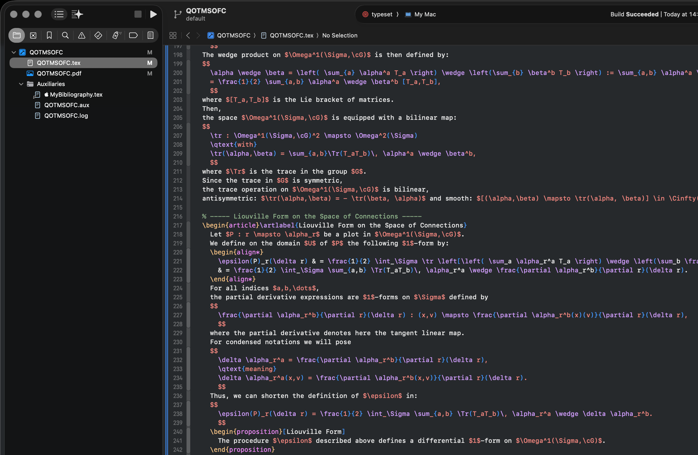

# TeX & LaTeX Syntax Highlighting for Xcode

This plugin provides robust syntax highlighting for TeX and LaTeX documents directly within the Xcode IDE, turning it into a powerful, minimalist environment for academic and technical writing.

It was originally created by Patrick Iglesias-Zemmour and has been updated and improved in collaboration with Google's Gemini to be stable and reliable for modern Xcode versions.

## Features

*   **Robust Highlighting:** A stable, predictable, and fast highlighting engine designed to never crash.
*   **Hybrid Math Environment Support:**
    *   **Inline Math (`$...$`):** Rendered as a simple, solid block of color to make it stand out clearly from surrounding text.
    *   **Displayed Math (`$$...$$`):** The entire block is colored, with commands and braces highlighted inside for readability in large equations.
    *   **Bracketed Math (`\[...\]`):** Treated as standard commands for maximum stability. The text inside is highlighted normally.
*   **Expanded File Support:** Syntax highlighting is also applied to LaTeX style (`.sty`), class (`.cls`), and bibliography (`.bbl`) files.
*   **Code Folding:** All `\begin{...}...\end{...}` environments are fully foldable for easy navigation.
*   **Structure Highlighting:** Commands, braces (`{}`, `()`, `[]`), and comments are clearly distinguished.
*   **Light and Dark Themes:** Includes "Basic TeX" (Light) and "Dark TeX" (Dark) themes.

## Compatibility

*   **Modern Xcode (15+):** Works natively. You must click **"Load Bundle"** when Xcode first launches after installation.
*   **Older Xcode (12-14):** Supported via a list of compatibility UUIDs. If the plugin does not load, you may need to add your Xcode's specific UUID to the `Info.plist` file inside the bundle.

## Installation

1.  Download the `.zip` file from the latest **[Release](https://github.com/p-i-z/TeX-Colorization-for-Xcode/releases)**.
2.  Unzip the file.
3.  **Important:** To run the installer, you must bypass the macOS security warning the first time. **Right-click** on the `Install TeX for Xcode.command` file and select **"Open"**.
4.  A dialog will appear. Click the **"Open"** button to run the script.

    *(After this first time, you can simply double-click the file to run it again if needed).*

A Terminal window will open and run the installer. You may be asked for your administrator password to complete the installation.

## Getting Started

1.  **Restart Xcode:** After installing, you must completely quit and restart Xcode.
2.  **Load the Bundle:** When prompted, click **"Load Bundle"**.
3.  **Select the Theme:** Go to **Xcode > Settings > Themes** and select either **"Basic TeX"** or **"Dark TeX"**.

## Source Code

Currently, this repository hosts the compiled plugin and the installation tools. The full Xcode project source is not included to keep the repository lightweight.

If you are a developer and wish to modify the plugin, please open an Issue or contact me. If there is interest, I will upload the full Xcode project structure here.

## License

This project is licensed under the [Creative Commons Attribution-ShareAlike 4.0 International License](https://creativecommons.org/licenses/by-sa/4.0/).