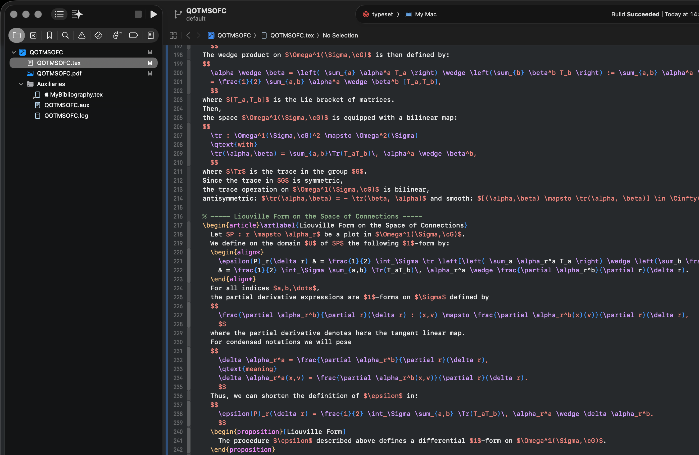

# TeX & LaTeX Syntax Highlighting for Xcode

This plugin provides robust syntax highlighting for TeX and LaTeX documents directly within the Xcode IDE.

Created by Patrick Iglesias-Zemmour. Updated with Google's Gemini and DeepSeek.



## Features

- Inline math `$...$` — solid red block
- Display math `$$...$$` and `\[...\]` — red, foldable, with highlighted commands and braces inside
- Purple commands (`\foo`)
- Blue braces (`{}()[]`)
- Gray comments (`%`)
- Foldable `\begin...\end` environments
- Light and Dark themes included

## Installation

1. Download and unzip the latest **[Release](https://github.com/p-i-z/TeX-Colorization-for-Xcode/releases)**

2. Open Terminal and navigate to the unzipped folder: `cd /path/to/unzipped/folder`

3. Run these three commands:
4. ```
   chmod +x "Install TeX for Xcode.command"
   xattr -d com.apple.quarantine "Install TeX for Xcode.command"
   ./Install TeX for Xcode.command
   ```

4. Enter your password when prompted

5. Restart Xcode and click **"Load Bundle"**

6. Go to **Xcode > Settings > Themes** and select **"Basic TeX"** or **"Dark TeX"**

## Building from Source

Open `TeX.xcodeproj`, set **"User Script Sandboxing"** to **No** in Build Settings, then press ⌘B.

## License

[Creative Commons Attribution-ShareAlike 4.0](https://creativecommons.org/licenses/by-sa/4.0/)